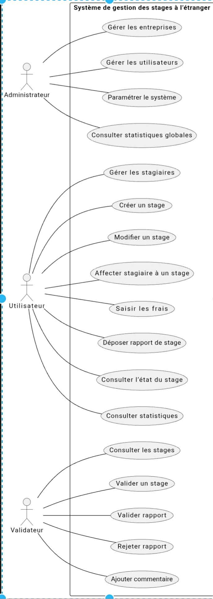

🎓 Gestion des Stages à l’Étranger
📌 Description du Projet

Ce projet est une application web développée dans le cadre d’un Projet de Fin d’Études (PFE).

L’objectif principal est de concevoir un système informatique de gestion des stages à l’étranger, permettant de centraliser, organiser et suivre l’ensemble du processus administratif et académique lié aux stages internationaux.

Le système assure :

✅ La gestion des stagiaires

✅ La gestion des entreprises partenaires

✅ La création et le suivi des stages

✅ La gestion des frais liés au stage

✅ Le dépôt et la validation des rapports

✅ La consultation des statistiques globales

🏗️ Architecture Technique
🔹 Backend

Java 17

Spring Boot 4

Spring Data JPA

Hibernate ORM

Maven

🔹 Base de Données

MySQL 8

Gestion automatique des entités via JPA

Génération automatique des tables

👥 Acteurs du Système
Acteur	Rôle
👨‍💼 Administrateur	Gère les entreprises, les utilisateurs et les statistiques
👨‍🎓 Utilisateur	Gère les stagiaires, stages et frais
🧑‍🏫 Validateur	Valide ou rejette les rapports de stage
📊 Modélisation UML
## 📊 Diagramme de Cas d’Utilisation

## 🧱 Diagramme de Classes

## 🔄 Diagramme de Séquence

🗃️ Modèle de Données
📌 Entités Principales

Entreprise

Utilisateur

Stage

Stagiaire

Frais

RapportStage

🔗 Relations

Une Entreprise possède plusieurs Stages

Un Stage contient plusieurs Stagiaires

Un Stage contient plusieurs Frais

Un Stagiaire possède un RapportStage

Un Validateur valide ou rejette un rapport

🚀 Installation et Exécution
1️⃣ Cloner le projet
git clone https://github.com/alaayadi705-dev/gestion-stages.git
cd gestion-stages

2️⃣ Configurer la base de données

Créer une base MySQL :

CREATE DATABASE gestion_stages;

Vérifier les paramètres dans :

src/main/resources/application.properties

3️⃣ Lancer l’application
mvn clean install
mvn spring-boot:run

Application accessible sur :

[http://localhost:8080](http://localhost:8080/api/stagiaires)

📌 Fonctionnalités Implémentées

CRUD complet des stagiaires

CRUD des stages

Affectation stagiaire à un stage

Gestion des frais

Dépôt et validation des rapports

Mise à jour automatique des statuts

🔐 Sécurité et Gestion des Rôles

Le système distingue plusieurs rôles :

ADMIN

UTILISATEUR

VALIDATEUR

Chaque rôle possède des permissions spécifiques adaptées à ses responsabilités.

📈 Perspectives d’Amélioration

Ajout d’un frontend en React

Authentification JWT

Tableau de bord statistique avancé

Upload réel des fichiers PDF

Déploiement cloud

👨‍💻 Auteur

Nom : Alaay
Projet : PFE – Système de gestion des stages à l’étranger
Année : 2026
