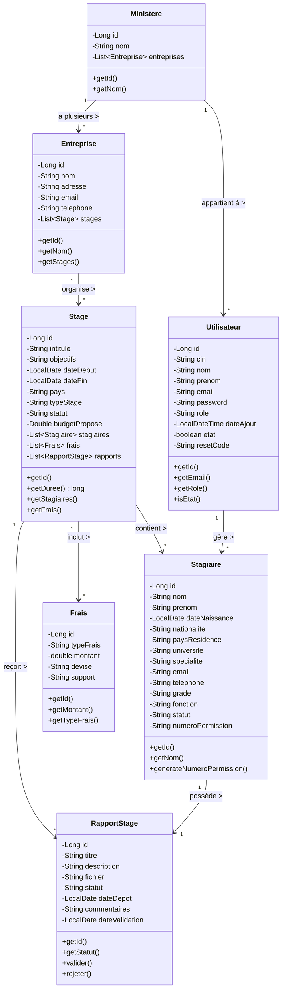
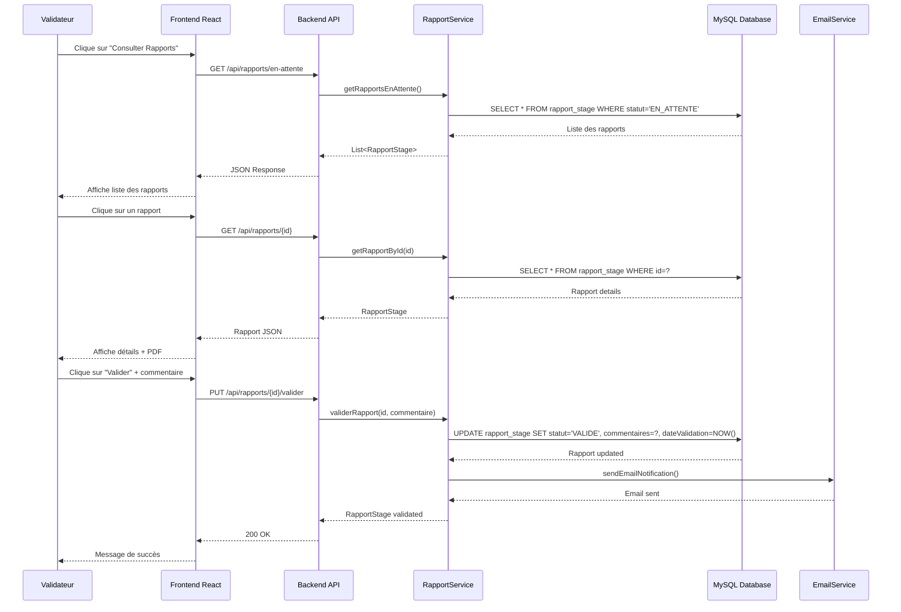
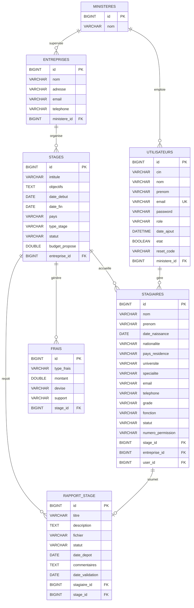
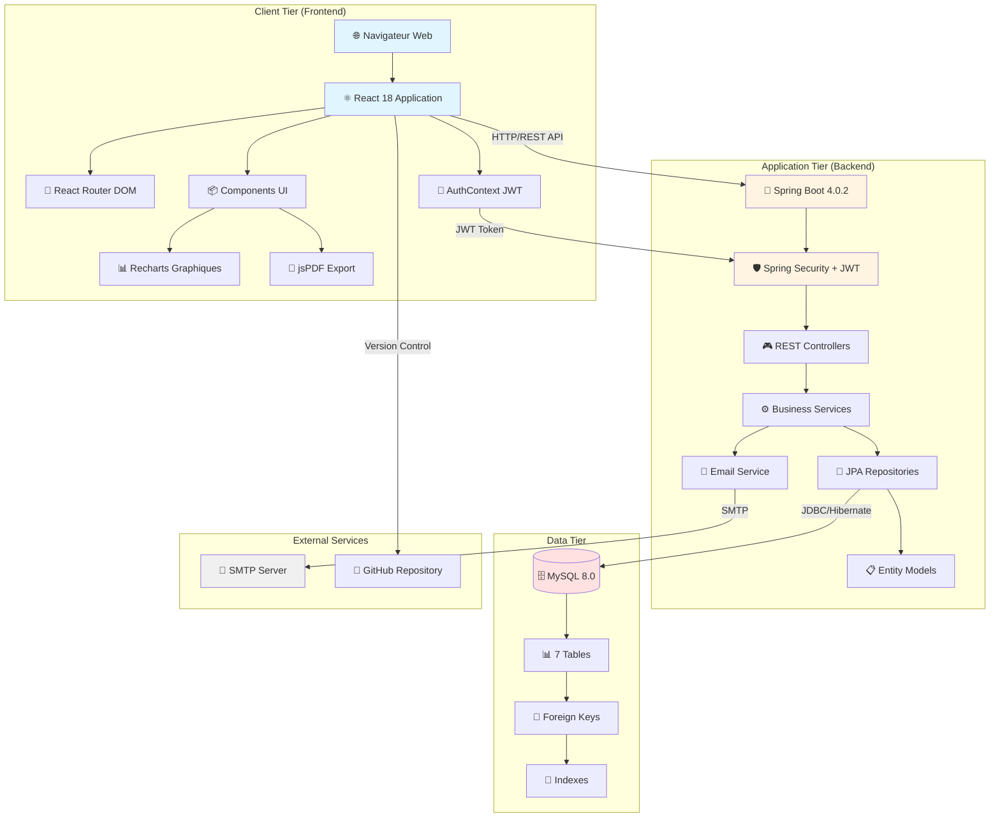

# Diagrammes UML - Système de Gestion des Stages à l'Étranger
## Projet PFE - Ayadi Ala Eddine 2026

---

## 1. DIAGRAMME DE CAS D'UTILISATION (USE CASE)

```mermaid
graph TD
    actor Admin as "👨‍💼 Administrateur"
    actor User as "👨‍🎓 Gestionnaire de Stages"
    actor Validator as "🧑‍🏫 Validateur"
    actor System as "⚙️ Système"
    
    %% Admin Use Cases
    Admin --> UC1[Gérer les Entreprises]
    Admin --> UC2[Gérer les Utilisateurs]
    Admin --> UC3[Consulter Statistiques]
    Admin --> UC4[Gérer Ministères]
    Admin --> UC5[Exporter Données PDF]
    
    %% User Use Cases
    User --> UC6[Gérer Stagiaires]
    User --> UC7[Gérer Stages]
    User --> UC8[Affecter Stagiaires à Stages]
    User --> UC9[Gérer Frais]
    User --> UC10[Rechercher & Filtrer]
    User --> UC11[Consulter Dashboard]
    
    %% Validator Use Cases
    Validator --> UC12[Valider Rapports]
    Validator --> UC13[Rejeter Rapports]
    Validator --> UC14[Consulter Rapports]
    
    %% System Automated Use Cases
    System --> UC15[Authentifier Utilisateur]
    System --> UC16[Générer Token JWT]
    System --> UC17[Générer N° Permission]
    System --> UC18[Calculer Durée Stage]
    System --> UC19[Calculer Total Frais]
    System --> UC20[Envoyer Email Notification]
    
    %% Relationships
    UC1 -.-> UC15
    UC2 -.-> UC15
    UC6 -.-> UC17
    UC7 -.-> UC18
    UC9 -.-> UC19
    UC12 -.-> UC20
```

### Description des Cas d'Utilisation:

| ID | Use Case | Acteur | Description |
|----|----------|--------|-------------|
| UC1 | Gérer les Entreprises | Admin | CRUD complet des entreprises d'accueil |
| UC2 | Gérer les Utilisateurs | Admin | Création, modification, suppression des utilisateurs avec rôles |
| UC3 | Consulter Statistiques | Admin | Visualisation des graphiques et KPIs |
| UC4 | Gérer Ministères | Admin | Gestion des ministères de tutelle |
| UC5 | Exporter Données PDF | Admin | Export des listes et rapports en PDF |
| UC6 | Gérer Stagiaires | User | CRUD des stagiaires avec génération auto N° permission |
| UC7 | Gérer Stages | User | CRUD des stages avec calcul automatique de durée |
| UC8 | Affecter Stagiaires | User | Association stagiaires aux stages |
| UC9 | Gérer Frais | User | Suivi des frais par stage avec calcul du total |
| UC10 | Rechercher & Filtrer | User | Recherche multicritère avec pagination |
| UC11 | Consulter Dashboard | User | Vue d'ensemble avec indicateurs |
| UC12 | Valider Rapports | Validator | Validation des rapports avec commentaires |
| UC13 | Rejeter Rapports | Validator | Rejet avec justification |
| UC14 | Consulter Rapports | Validator | Liste des rapports soumis |
| UC15 | Authentifier Utilisateur | Système | Login avec email/mot de passe |
| UC16 | Générer Token JWT | Système | Création token après auth réussie |
| UC17 | Générer N° Permission | Système | Format: AA/NNNNNNN/1 |
| UC18 | Calculer Durée Stage | Système | Calcul en jours entre dates |
| UC19 | Calculer Total Frais | Système | Somme des frais par stage |
| UC20 | Envoyer Email | Système | Notification validation/rejet |

---

## 2. DIAGRAMME DE CLASSES (CLASS DIAGRAM)



### Relations détaillées:

| Relation | Type | Description |
|----------|------|-------------|
| Ministere → Entreprise | One-to-Many | Un ministère supervise plusieurs entreprises |
| Ministere → Utilisateur | One-to-Many | Un ministère a plusieurs utilisateurs |
| Entreprise → Stage | One-to-Many | Une entreprise organise plusieurs stages |
| Stage → Stagiaire | One-to-Many | Un stage accueille plusieurs stagiaires |
| Stage → Frais | One-to-Many | Un stage a plusieurs frais associés |
| Stage → RapportStage | One-to-Many | Un stage reçoit plusieurs rapports |
| Stagiaire → RapportStage | One-to-One | Un stagiaire possède un rapport |
| Utilisateur → Stagiaire | One-to-Many | Un utilisateur gère plusieurs stagiaires |

---

## 3. DIAGRAMME DE SÉQUENCE - Validation de Rapport de Stage



### Étapes détaillées:

1. **Consultation de la liste**
   - Validateur accède à la page des rapports
   - Frontend appelle l'API pour récupérer les rapports en attente
   - Backend interroge la base de données
   - Liste affichée avec filtres

2. **Consultation d'un rapport**
   - Validateur sélectionne un rapport
   - Récupération des détails complets
   - Affichage des informations du stagiaire et du stage
   - Lien de téléchargement du PDF

3. **Validation du rapport**
   - Validateur ajoute un commentaire
   - Clique sur "Valider"
   - API met à jour le statut en "VALIDE"
   - Date de validation enregistrée
   - Email de notification envoyé au stagiaire
   - Confirmation affichée

---

## 4. SCHÉMA DE BASE DE DONNÉES (DATABASE SCHEMA)



### Tables et Index:

| Table | Primary Key | Foreign Keys | Indexes |
|-------|-------------|--------------|---------|
| ministeres | id | - | nom (UNIQUE) |
| utilisateurs | id | ministere_id | email (UNIQUE), role |
| entreprises | id | ministere_id | nom |
| stages | id | entreprise_id | statut, pays, date_debut |
| stagiaires | id | stage_id, entreprise_id, user_id | email, statut, numero_permission |
| frais | id | stage_id | type_frais |
| rapport_stage | id | stagiaire_id, stage_id | statut, date_depot |

---

## 5. ARCHITECTURE GLOBALE DU SYSTÈME



### Architecture 3-Tiers Détaillée:

#### **Tier 1: Présentation (Frontend)**
- **Technologie**: React 18.2.0
- **Port**: 3000 (development)
- **Composants principaux**:
  - DataTable (affichage des données)
  - StagiaireCard (cartes stagiaires)
  - Layout (Sidebar + Header)
  - ProtectedRoute (sécurité routing)
  - Recharts (graphiques)
  - jsPDF (export PDF)
- **State Management**: Context API (AuthContext)
- **HTTP Client**: Axios

#### **Tier 2: Application (Backend)**
- **Technologie**: Spring Boot 4.0.2
- **Port**: 8080
- **Architecture**: MVC + REST
- **Couches**:
  - Controllers (9 REST + 7 Web)
  - Services (logique métier)
  - Repositories (accès données)
  - Entities (modèle JPA)
- **Sécurité**: Spring Security + JWT
- **Email**: Spring Mail (SMTP)

#### **Tier 3: Données**
- **SGBD**: MySQL 8.0.45
- **Port**: 3306
- **Base**: gestion_stages
- **Tables**: 7 tables principales
- **ORM**: Hibernate 7.2.1
- **Connection Pool**: HikariCP

### Flux de Données:

```
Utilisateur → Navigateur → React App → Axios HTTP Request
                                    ↓
                           Spring Boot API (Port 8080)
                                    ↓
                        Spring Security (JWT Validation)
                                    ↓
                           Controller Layer
                                    ↓
                           Service Layer (Business Logic)
                                    ↓
                        Repository Layer (JPA/Hibernate)
                                    ↓
                           MySQL Database (Port 3306)
                                    ↓
                        Response → Controller → JSON
                                    ↓
                           React Updates UI
```

---

## RÉSUMÉ DES TECHNOLOGIES

### Backend:
| Technologie | Version | Utilisation |
|-------------|---------|-------------|
| Java JDK | 17 | Langage principal |
| Spring Boot | 4.0.2 | Framework backend |
| Spring Security | - | Authentification |
| Spring Data JPA | - | ORM |
| Hibernate | 7.2.1 | Implémentation JPA |
| MySQL Connector | 8.0.45 | Driver BD |
| JWT (jjwt) | 0.12.5 | Tokens |
| Maven | - | Build tool |

### Frontend:
| Technologie | Version | Utilisation |
|-------------|---------|-------------|
| React | 18.2.0 | UI Library |
| React Router | 7.13.1 | Routing |
| Axios | 1.13.6 | HTTP Client |
| Recharts | 3.8.1 | Graphiques |
| jsPDF | 5.0.7 | Export PDF |
| React Icons | 5.6.0 | Icônes |
| Node.js | - | Runtime |

### Base de Données:
| Technologie | Version | Utilisation |
|-------------|---------|-------------|
| MySQL | 8.0.45 | SGBD |
| HikariCP | - | Connection Pool |
| Hibernate | 7.2.1 | ORM |

---

## COMMENT GÉNÉRER LES IMAGES DES DIAGRAMMES

### Option 1: Mermaid Live Editor (Recommandé)
1. Aller sur: https://mermaid.live/
2. Copier le code Mermaid de chaque diagramme
3. Télécharger en PNG, SVG ou PDF

### Option 2: VS Code Extension
1. Installer l'extension "Markdown Preview Mermaid Support"
2. Ouvrir ce fichier
3. Preview → Export as Image

### Option 3: PlantUML
Si vous préférez PlantUML, je peux convertir ces diagrammes.

---

**Auteur**: Ayadi Ala Eddine  
**Projet**: Système de Gestion des Stages à l'Étranger  
**Année**: 2025-2026  
**Framework**: SCRUM  
**Université**: Faculté des Sciences et Techniques de Sidi Bouzid
