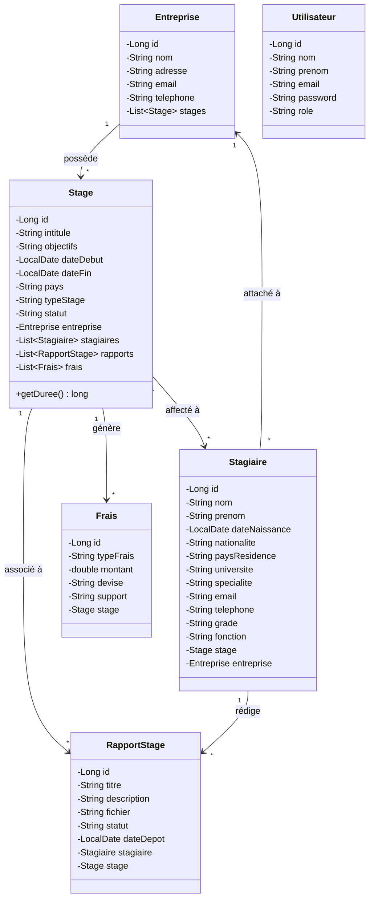
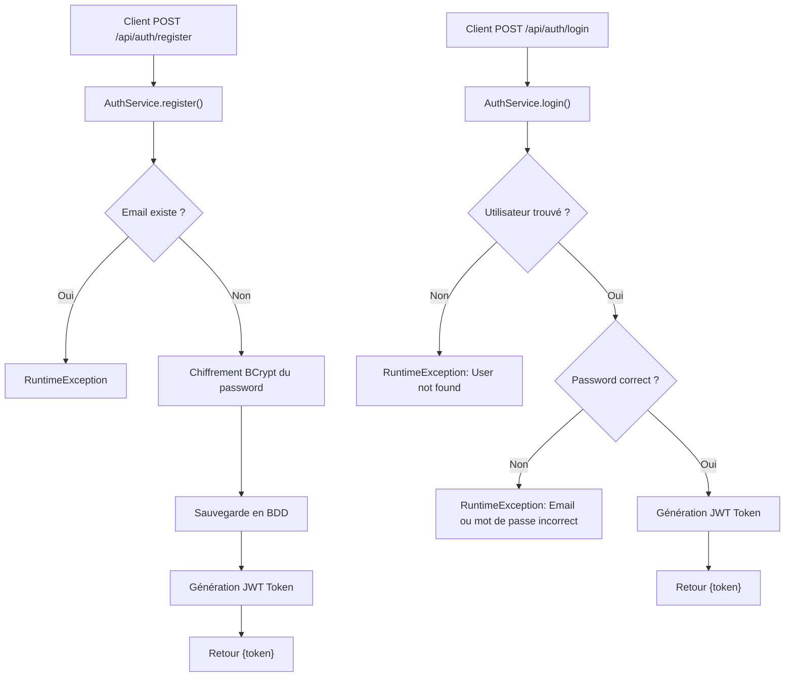
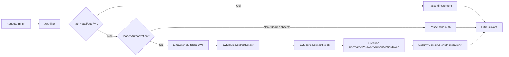
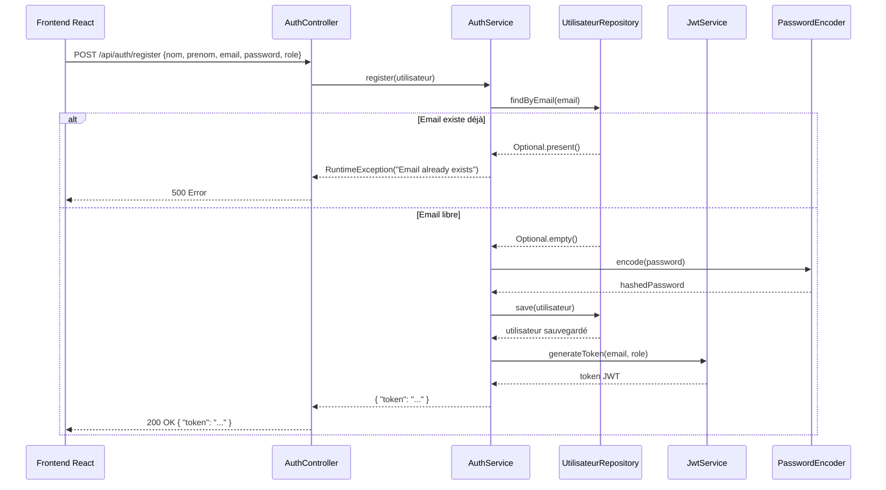
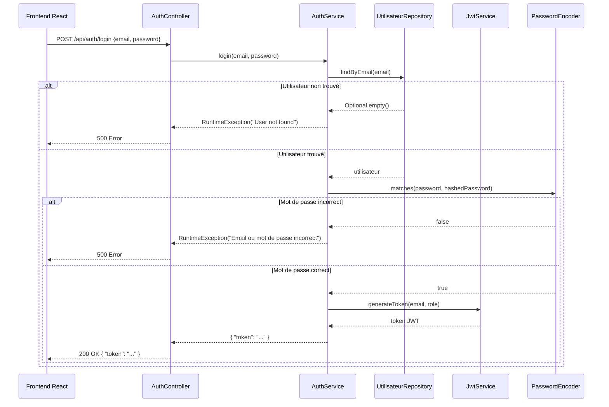
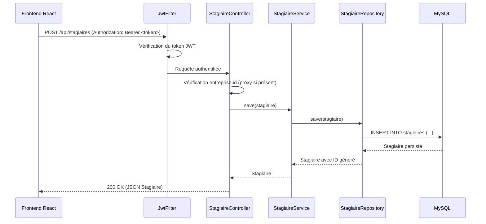
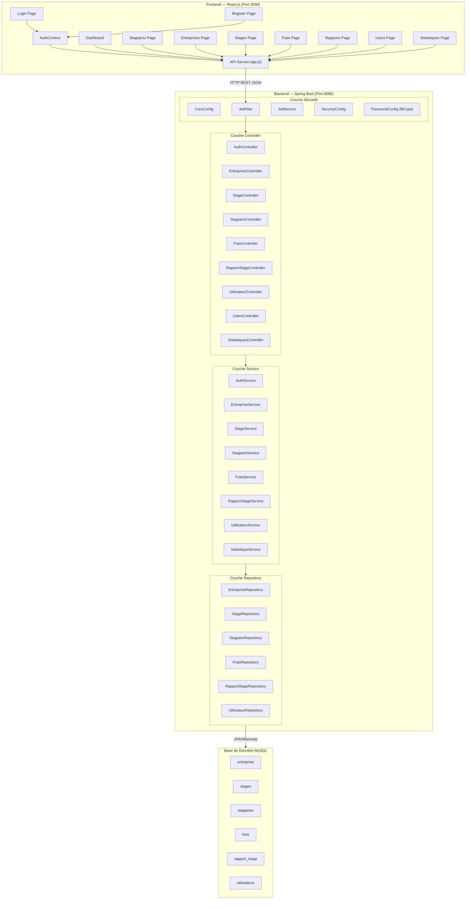

# Documentation Technique — Système de Gestion des Stages

---

## Table des matières

1. [Présentation Générale](#1-présentation-générale)
2. [Architecture Globale](#2-architecture-globale)
3. [Stack Technologique](#3-stack-technologique)
4. [Diagramme de Classes (Modèle de Données)](#4-diagramme-de-classes)
5. [Description des Entités JPA](#5-description-des-entités-jpa)
6. [Couche Repository (Accès aux Données)](#6-couche-repository)
7. [Couche Service (Logique Métier)](#7-couche-service)
8. [Couche Controller (API REST)](#8-couche-controller)
9. [Sécurité et Authentification](#9-sécurité-et-authentification)
10. [Diagramme de Séquence — Flux d'Authentification](#10-diagramme-de-séquence)
11. [Architecture Frontend](#11-architecture-frontend)
12. [Catalogue des Endpoints API](#12-catalogue-des-endpoints-api)
13. [Configuration de l'Application](#13-configuration)
14. [Diagramme d'Architecture Applicative](#14-diagramme-architecture-applicative)

---

## 1. Présentation Générale

Le projet **Gestion des Stages** est une application web full-stack destinée à la gestion complète du cycle de vie des stages en entreprise. Elle permet de :

- **Gérer les stagiaires** : inscription, suivi, affectation aux stages et aux entreprises
- **Gérer les entreprises** partenaires : création, modification, suppression
- **Gérer les stages** : création avec dates, pays, statut, objectifs, et liaison avec une entreprise
- **Gérer les frais** liés aux stages : type, montant, devise, support
- **Gérer les rapports de stage** : dépôt, validation, rejet
- **Gérer les utilisateurs** du système avec authentification sécurisée via JWT
- **Visualiser des statistiques** : tableaux de bord avec indicateurs par pays, par stage, par statut

---

## 2. Architecture Globale

L'application suit une **architecture 3-tiers** basée sur le pattern **MVC (Model-View-Controller)** :

```
┌──────────────────────────────────────────────────────────┐
│                   FRONTEND (React.js)                    │
│  ┌──────────┐  ┌──────────┐  ┌───────────────────────┐  │
│  │  Pages   │  │Components│  │    Services (API)      │  │
│  │ (Views)  │  │ (UI)     │  │ (fetch → REST)        │  │
│  └──────────┘  └──────────┘  └───────────────────────┘  │
│                        │                                 │
│                   AuthContext                             │
│              (Gestion du token JWT)                      │
└──────────────────────┬───────────────────────────────────┘
                       │  HTTP (JSON)
                       │  Port 3000 → Port 8080
                       ▼
┌──────────────────────────────────────────────────────────┐
│               BACKEND (Spring Boot 4.0.2)                │
│                                                          │
│  ┌─────────────────────────────────────────────────────┐ │
│  │            Security Layer (JWT + CORS)               │ │
│  │  JwtFilter → JwtService → SecurityConfig            │ │
│  └─────────────────────────────────────────────────────┘ │
│                        │                                 │
│  ┌─────────────────────────────────────────────────────┐ │
│  │              Controllers (REST API)                  │ │
│  │  /api/auth  /api/stagiaires  /api/entreprises       │ │
│  │  /api/stages  /api/rapports  /api/frais             │ │
│  │  /api/statistiques  /api/utilisateurs  /api/users   │ │
│  └─────────────────────────────────────────────────────┘ │
│                        │                                 │
│  ┌─────────────────────────────────────────────────────┐ │
│  │                Services (Logique Métier)             │ │
│  │  AuthService  EntrepriseService  StageService       │ │
│  │  StagiaireService  FraisService  RapportStageService│ │
│  │  StatistiqueService  UtilisateurService             │ │
│  └─────────────────────────────────────────────────────┘ │
│                        │                                 │
│  ┌─────────────────────────────────────────────────────┐ │
│  │              Repositories (JPA / Hibernate)          │ │
│  │  EntrepriseRepository  StageRepository              │ │
│  │  StagiaireRepository  FraisRepository               │ │
│  │  RapportStageRepository  UtilisateurRepository      │ │
│  └─────────────────────────────────────────────────────┘ │
│                        │                                 │
│  ┌─────────────────────────────────────────────────────┐ │
│  │                 Entities (JPA)                       │ │
│  │  Entreprise  Stage  Stagiaire  Frais                │ │
│  │  RapportStage  Utilisateur                          │ │
│  └─────────────────────────────────────────────────────┘ │
└──────────────────────┬───────────────────────────────────┘
                       │  JDBC
                       ▼
┌──────────────────────────────────────────────────────────┐
│                  BASE DE DONNÉES                         │
│                MySQL (gestion_stages)                    │
│                                                          │
│   Tables : entreprise, stages, stagiaires, frais,        │
│            rapport_stage, utilisateurs                   │
└──────────────────────────────────────────────────────────┘
```

---

## 3. Stack Technologique

| Couche | Technologie | Version |
|--------|-------------|---------|
| **Backend** | Spring Boot | 4.0.2 |
| **Langage Backend** | Java | 17 |
| **ORM** | Spring Data JPA / Hibernate | — |
| **Sécurité** | Spring Security + JWT (jjwt) | 0.12.5 |
| **Base de Données** | MySQL | — |
| **Connecteur BDD** | mysql-connector-j | — |
| **Chiffrement** | BCrypt (PasswordEncoder) | — |
| **Frontend** | React.js | — |
| **Communication** | REST API (JSON) | — |
| **Build** | Maven | — |

---

## 4. Diagramme de Classes

Le diagramme ci-dessous représente le modèle de données et les relations entre les entités :



### Relations JPA

| Relation | Type | Description |
|----------|------|-------------|
| `Entreprise` → `Stage` | `@OneToMany` (mappedBy="entreprise") | Une entreprise possède plusieurs stages |
| `Stage` → `Entreprise` | `@ManyToOne` (FetchType.EAGER) | Un stage appartient à une entreprise |
| `Stage` → `Stagiaire` | `@OneToMany` (mappedBy="stage") | Un stage peut avoir plusieurs stagiaires |
| `Stagiaire` → `Stage` | `@ManyToOne` | Un stagiaire est affecté à un stage |
| `Stagiaire` → `Entreprise` | `@ManyToOne` (FetchType.EAGER) | Un stagiaire est attaché à une entreprise |
| `Stage` → `Frais` | `@OneToMany` (mappedBy="stage") | Un stage génère des frais |
| `Frais` → `Stage` | `@ManyToOne` (FetchType.EAGER, optional=false) | Un frais est obligatoirement lié à un stage |
| `Stage` → `RapportStage` | `@OneToMany` (mappedBy="stage") | Un stage a plusieurs rapports |
| `RapportStage` → `Stage` | `@ManyToOne` (FetchType.EAGER) | Un rapport est associé à un stage |
| `RapportStage` → `Stagiaire` | `@ManyToOne` (FetchType.EAGER) | Un rapport est rédigé par un stagiaire |

> **Note :** Les annotations `@JsonIgnore` et `@JsonIgnoreProperties` sont utilisées pour éviter les boucles de sérialisation JSON infinies entre les relations bidirectionnelles.

---

## 5. Description des Entités JPA

### 5.1 Entreprise
**Table :** `entreprise`

| Attribut | Type | Contraintes | Description |
|----------|------|-------------|-------------|
| `id` | Long | PK, Auto-généré | Identifiant unique |
| `nom` | String | — | Nom de l'entreprise |
| `adresse` | String | — | Adresse physique |
| `email` | String | — | Email de contact |
| `telephone` | String | — | Numéro de téléphone |
| `stages` | List\<Stage\> | @OneToMany, cascade ALL, orphanRemoval | Liste des stages associés |

### 5.2 Stage
**Table :** `stages`

| Attribut | Type | Contraintes | Description |
|----------|------|-------------|-------------|
| `id` | Long | PK, Auto-généré | Identifiant unique |
| `intitule` | String | — | Titre du stage |
| `objectifs` | String | — | Objectifs du stage |
| `dateDebut` | LocalDate | — | Date de début |
| `dateFin` | LocalDate | — | Date de fin |
| `pays` | String | — | Pays du stage |
| `typeStage` | String | — | Type (PFE, Observation, etc.) |
| `statut` | String | — | Statut (EN_COURS, CLOTURE) |
| `entreprise` | Entreprise | @ManyToOne | Entreprise d'accueil |

**Méthode calculée :** `getDuree()` — retourne la durée en jours entre `dateDebut` et `dateFin` via `ChronoUnit.DAYS.between()`.

### 5.3 Stagiaire
**Table :** `stagiaires`

| Attribut | Type | Contraintes | Description |
|----------|------|-------------|-------------|
| `id` | Long | PK, Auto-généré | Identifiant unique |
| `nom` | String | — | Nom de famille |
| `prenom` | String | — | Prénom |
| `dateNaissance` | LocalDate | — | Date de naissance |
| `nationalite` | String | — | Nationalité |
| `paysResidence` | String | — | Pays de résidence |
| `universite` | String | — | Université d'origine |
| `specialite` | String | — | Spécialité académique |
| `email` | String | — | Email |
| `telephone` | String | — | Téléphone |
| `grade` | String | — | Grade académique |
| `fonction` | String | — | Fonction occupée |
| `stage` | Stage | @ManyToOne | Stage affecté |
| `entreprise` | Entreprise | @ManyToOne | Entreprise d'accueil |

### 5.4 Frais
**Table :** `frais`

| Attribut | Type | Contraintes | Description |
|----------|------|-------------|-------------|
| `id` | Long | PK, Auto-généré | Identifiant unique |
| `typeFrais` | String | — | Type de frais (transport, hébergement…) |
| `montant` | double | — | Montant du frais |
| `devise` | String | — | Devise (MAD, EUR, USD…) |
| `support` | String | — | Justificatif / support |
| `stage` | Stage | @ManyToOne, non optionnel | Stage associé (obligatoire) |

### 5.5 RapportStage
**Table :** `rapport_stage`

| Attribut | Type | Contraintes | Description |
|----------|------|-------------|-------------|
| `id` | Long | PK, Auto-généré | Identifiant unique |
| `titre` | String | — | Titre du rapport |
| `description` | String | — | Description du contenu |
| `fichier` | String | — | Chemin/nom du fichier |
| `statut` | String | Défaut : "EN_ATTENTE" | Statut (EN_ATTENTE, VALIDE, REFUSE, DEPOSE) |
| `dateDepot` | LocalDate | Défaut : date du jour | Date de dépôt (auto-initialisée) |
| `stagiaire` | Stagiaire | @ManyToOne | Stagiaire rédacteur |
| `stage` | Stage | @ManyToOne | Stage concerné |

### 5.6 Utilisateur
**Table :** `utilisateurs`

| Attribut | Type | Contraintes | Description |
|----------|------|-------------|-------------|
| `id` | Long | PK, Auto-généré | Identifiant unique |
| `nom` | String | — | Nom |
| `prenom` | String | — | Prénom |
| `email` | String | UNIQUE, NOT NULL | Email (identifiant) |
| `password` | String | NOT NULL | Mot de passe (chiffré BCrypt) |
| `role` | String | NOT NULL | Rôle (ADMIN, USER, etc.) |

---

## 6. Couche Repository (Accès aux Données)

Chaque repository étend `JpaRepository<T, Long>` et hérite automatiquement des opérations CRUD de base : `findAll()`, `findById()`, `save()`, `deleteById()`, `count()`.

### 6.1 EntrepriseRepository
```java
public interface EntrepriseRepository extends JpaRepository<Entreprise, Long> { }
```
> Aucune requête personnalisée — utilise les méthodes standards.

### 6.2 StageRepository
```java
public interface StageRepository extends JpaRepository<Stage, Long> {
    @Query("SELECT s.pays, COUNT(s) FROM Stage s GROUP BY s.pays")
    List<Object[]> countStagesByPays();

    long countByStatut(String statut);
}
```
| Méthode | Type | Description |
|---------|------|-------------|
| `countStagesByPays()` | JPQL | Nombre de stages groupés par pays |
| `countByStatut(statut)` | Derived Query | Nombre de stages par statut (EN_COURS, CLOTURE) |

### 6.3 StagiaireRepository
```java
public interface StagiaireRepository extends JpaRepository<Stagiaire, Long> {
    @Query("SELECT s.paysResidence, COUNT(s) FROM Stagiaire s GROUP BY s.paysResidence")
    List<Object[]> countStagiairesByPays();
}
```
| Méthode | Type | Description |
|---------|------|-------------|
| `countStagiairesByPays()` | JPQL | Distribution des stagiaires par pays de résidence |

### 6.4 FraisRepository
```java
public interface FraisRepository extends JpaRepository<Frais, Long> {
    @Query("SELECT f.stage.id, SUM(f.montant) FROM Frais f GROUP BY f.stage.id")
    List<Object[]> sumMontantByStage();

    @Query("SELECT f.stage.pays, SUM(f.montant) FROM Frais f GROUP BY f.stage.pays")
    List<Object[]> sumMontantByPays();

    @Query("SELECT COALESCE(SUM(f.montant),0) FROM Frais f")
    Double sumMontantTotal();
}
```
| Méthode | Type | Description |
|---------|------|-------------|
| `sumMontantByStage()` | JPQL | Coût total des frais groupé par stage |
| `sumMontantByPays()` | JPQL | Coût total des frais groupé par pays |
| `sumMontantTotal()` | JPQL | Somme totale de tous les frais (avec COALESCE pour éviter null) |

### 6.5 RapportStageRepository
```java
public interface RapportStageRepository extends JpaRepository<RapportStage, Long> {
    long countByStatut(String statut);
}
```
| Méthode | Type | Description |
|---------|------|-------------|
| `countByStatut(statut)` | Derived Query | Comptage de rapports par statut |

### 6.6 UtilisateurRepository
```java
public interface UtilisateurRepository extends JpaRepository<Utilisateur, Long> {
    Optional<Utilisateur> findByEmail(String email);
}
```
| Méthode | Type | Description |
|---------|------|-------------|
| `findByEmail(email)` | Derived Query | Recherche d'utilisateur par email (pour l'authentification) |

---

## 7. Couche Service (Logique Métier)

### 7.1 AuthService — Service d'Authentification

**Package :** `com.example.gestionstages.service`
**Dépendances :** `UtilisateurRepository`, `JwtService`, `PasswordEncoder`



| Méthode | Paramètres | Retour | Description |
|---------|-----------|--------|-------------|
| `register(Utilisateur)` | Objet utilisateur complet | `Map<String, String>` contenant le token | Vérifie unicité email, chiffre le mot de passe (BCrypt), sauvegarde, génère et retourne un JWT |
| `login(email, password)` | Email + mot de passe en clair | `Map<String, String>` contenant le token | Recherche par email, vérifie le mot de passe via `passwordEncoder.matches()`, génère et retourne un JWT |

### 7.2 EntrepriseService — Gestion des Entreprises

**Dépendances :** `EntrepriseRepository`

| Méthode | Retour | Description |
|---------|--------|-------------|
| `getAll()` | `List<Entreprise>` | Récupère toutes les entreprises |
| `getById(Long id)` | `Optional<Entreprise>` | Recherche une entreprise par ID |
| `save(Entreprise)` | `Entreprise` | Crée ou met à jour une entreprise |
| `delete(Long id)` | `void` | Supprime une entreprise par ID |

### 7.3 StageService — Gestion des Stages

**Dépendances :** `StageRepository`

| Méthode | Retour | Description |
|---------|--------|-------------|
| `getAll()` | `List<Stage>` | Liste tous les stages |
| `getById(Long id)` | `Optional<Stage>` | Recherche un stage par ID |
| `save(Stage)` | `Stage` | Crée ou met à jour un stage |
| `delete(Long id)` | `void` | Supprime un stage |

### 7.4 StagiaireService — Gestion des Stagiaires

**Dépendances :** `StagiaireRepository`

| Méthode | Retour | Description |
|---------|--------|-------------|
| `getAll()` | `List<Stagiaire>` | Liste tous les stagiaires |
| `getById(Long id)` | `Optional<Stagiaire>` | Recherche un stagiaire par ID |
| `save(Stagiaire)` | `Stagiaire` | Crée ou met à jour un stagiaire |
| `delete(Long id)` | `void` | Supprime un stagiaire |

### 7.5 FraisService — Gestion des Frais

**Dépendances :** `FraisRepository`

| Méthode | Retour | Description |
|---------|--------|-------------|
| `getAll()` | `List<Frais>` | Liste tous les frais |
| `save(Frais)` | `Frais` | Crée ou met à jour un frais |
| `delete(Long id)` | `void` | Supprime un frais |

### 7.6 RapportStageService — Gestion des Rapports de Stage

**Dépendances :** `RapportStageRepository`

| Méthode | Retour | Description |
|---------|--------|-------------|
| `getAll()` | `List<RapportStage>` | Liste tous les rapports |
| `getById(Long id)` | `Optional<RapportStage>` | Recherche par ID |
| `save(RapportStage)` | `RapportStage` | Crée ou met à jour un rapport |
| `delete(Long id)` | `void` | Supprime un rapport |

### 7.7 UtilisateurService — Gestion des Utilisateurs

**Dépendances :** `UtilisateurRepository`, `PasswordEncoder`

| Méthode | Retour | Description |
|---------|--------|-------------|
| `getAll()` | `List<Utilisateur>` | Liste tous les utilisateurs |
| `getById(Long id)` | `Optional<Utilisateur>` | Recherche par ID |
| `save(Utilisateur)` | `Utilisateur` | Crée/met à jour avec **chiffrement automatique** du mot de passe |
| `delete(Long id)` | `void` | Supprime un utilisateur |

> **Important :** Le mot de passe est systématiquement chiffré avec BCrypt avant la sauvegarde.

### 7.8 StatistiqueService — Statistiques et Tableaux de Bord

**Dépendances :** `StageRepository`, `FraisRepository`

| Méthode | Retour | Description |
|---------|--------|-------------|
| `getStatistiquesParPays()` | `List<StatistiqueDTO>` | Agrégation par pays : nombre de stagiaires, nombre de stages, coût total |

**Mécanisme :** Utilise Java Streams pour grouper les stages par pays (`Collectors.groupingBy`), puis calcule pour chaque pays le nombre de stages et le coût total des frais associés.

---

## 8. Couche Controller (API REST)

Tous les contrôleurs sont annotés `@RestController` et exposent des endpoints REST au format JSON. La plupart utilisent `@CrossOrigin("*")` pour autoriser les requêtes cross-origin.

### 8.1 AuthController

**Base URL :** `/api/auth`

| Méthode HTTP | Endpoint | Corps | Réponse | Description |
|:---:|----------|-------|---------|-------------|
| `POST` | `/api/auth/register` | `Utilisateur` (JSON) | `{ "token": "..." }` | Inscription d'un nouvel utilisateur |
| `POST` | `/api/auth/login` | `AuthRequest` (JSON) | `{ "token": "..." }` | Connexion et obtention du JWT |

### 8.2 EntrepriseController

**Base URL :** `/api/entreprises`

| Méthode HTTP | Endpoint | Corps | Réponse | Description |
|:---:|----------|-------|---------|-------------|
| `GET` | `/api/entreprises` | — | `List<Entreprise>` | Liste toutes les entreprises |
| `GET` | `/api/entreprises/{id}` | — | `Entreprise` | Détails d'une entreprise |
| `POST` | `/api/entreprises` | `Entreprise` (JSON) | `Entreprise` | Créer une entreprise |
| `PUT` | `/api/entreprises/{id}` | `Entreprise` (JSON) | `Entreprise` | Modifier une entreprise |
| `DELETE` | `/api/entreprises/{id}` | — | `String` (message) | Supprimer une entreprise |

### 8.3 StageController

**Base URL :** `/api/stages`

| Méthode HTTP | Endpoint | Corps | Réponse | Description |
|:---:|----------|-------|---------|-------------|
| `GET` | `/api/stages` | — | `List<Stage>` | Liste tous les stages |
| `GET` | `/api/stages/{id}` | — | `Stage` | Détails d'un stage |
| `POST` | `/api/stages` | `Stage` (JSON) | `Stage` | Créer un stage |
| `PUT` | `/api/stages/{id}` | `Stage` (JSON) | `Stage` | Modifier un stage |
| `DELETE` | `/api/stages/{id}` | — | `void` | Supprimer un stage |

### 8.4 StagiaireController

**Base URL :** `/api/stagiaires`

| Méthode HTTP | Endpoint | Corps | Réponse | Description |
|:---:|----------|-------|---------|-------------|
| `GET` | `/api/stagiaires` | — | `List<Stagiaire>` | Liste tous les stagiaires |
| `GET` | `/api/stagiaires/{id}` | — | `Stagiaire` | Détails d'un stagiaire |
| `POST` | `/api/stagiaires` | `Stagiaire` (JSON) | `Stagiaire` | Créer un stagiaire |
| `PUT` | `/api/stagiaires/{id}` | `Stagiaire` (JSON) | `Stagiaire` | Modifier un stagiaire |
| `DELETE` | `/api/stagiaires/{id}` | — | `void` | Supprimer un stagiaire |

> **Particularité du `POST` :** Gère automatiquement la référence à `Entreprise` — si l'objet `entreprise` contient un `id`, un objet proxy avec uniquement l'ID est créé pour éviter les problèmes de persistance.

### 8.5 FraisController

**Base URL :** `/api/frais`

| Méthode HTTP | Endpoint | Corps | Réponse | Description |
|:---:|----------|-------|---------|-------------|
| `GET` | `/api/frais` | — | `List<Frais>` | Liste tous les frais |
| `POST` | `/api/frais` | `Frais` (JSON) | `Frais` | Ajouter un frais |
| `DELETE` | `/api/frais/{id}` | — | `void` | Supprimer un frais |

> **Note :** Ce contrôleur utilise directement `FraisRepository` via `@Autowired` (injection par champ), sans passer par `FraisService`.

### 8.6 RapportStageController

**Base URL :** `/api/rapports`

| Méthode HTTP | Endpoint | Corps | Réponse | Description |
|:---:|----------|-------|---------|-------------|
| `GET` | `/api/rapports` | — | `List<RapportStage>` | Liste tous les rapports |
| `GET` | `/api/rapports/{id}` | — | `RapportStage` | Détails d'un rapport |
| `POST` | `/api/rapports` | `RapportStage` (JSON) | `RapportStage` | Créer un rapport |
| `PUT` | `/api/rapports/{id}` | `RapportStage` (JSON) | `RapportStage` | Modifier un rapport (titre, description, statut, fichier, stagiaire) |
| `DELETE` | `/api/rapports/{id}` | — | `void` | Supprimer un rapport |

### 8.7 StatistiquesController

**Base URL :** `/api/statistiques`

| Méthode HTTP | Endpoint | Réponse | Description |
|:---:|----------|---------|-------------|
| `GET` | `/api/statistiques` | `Map<String, Object>` | Retourne toutes les statistiques du tableau de bord |

**Données retournées :**

```json
{
  "totalStagiaires": 25,
  "totalEntreprises": 10,
  "totalStages": 15,
  "totalRapports": 12,
  "totalFrais": 50000.0,
  "stagesParPays": [["Maroc", 5], ["France", 3]],
  "stagiairesParPays": [["Maroc", 10], ["Tunisie", 5]],
  "coutParStage": [[1, 15000.0], [2, 8000.0]],
  "coutParPays": [["Maroc", 30000.0], ["France", 20000.0]],
  "stagesEnCours": 8,
  "stagesClotures": 7,
  "rapportsDeposes": 4,
  "rapportsValides": 5,
  "rapportsRejetes": 1,
  "rapportsEnAttente": 2
}
```

### 8.8 UtilisateurController

**Base URL :** `/api/utilisateurs`

| Méthode HTTP | Endpoint | Corps | Réponse | Description |
|:---:|----------|-------|---------|-------------|
| `GET` | `/api/utilisateurs` | — | `List<Utilisateur>` | Liste tous les utilisateurs |
| `GET` | `/api/utilisateurs/{id}` | — | `Utilisateur` | Détails d'un utilisateur |
| `POST` | `/api/utilisateurs` | `Utilisateur` (JSON) | `Utilisateur` | Créer un utilisateur (password chiffré automatiquement) |
| `PUT` | `/api/utilisateurs/{id}` | `Utilisateur` (JSON) | `Utilisateur` | Modifier un utilisateur |
| `DELETE` | `/api/utilisateurs/{id}` | — | `void` | Supprimer un utilisateur |

### 8.9 UsersController

**Base URL :** `/api/users`

| Méthode HTTP | Endpoint | Corps | Réponse | Description |
|:---:|----------|-------|---------|-------------|
| `GET` | `/api/users` | — | `List<Utilisateur>` | Liste tous les utilisateurs |
| `POST` | `/api/users` | `Utilisateur` (JSON) | `Utilisateur` | Ajouter un utilisateur |
| `DELETE` | `/api/users/{id}` | — | `void` | Supprimer un utilisateur |

> **Note :** Ce contrôleur utilise directement `UtilisateurRepository` via `@Autowired`, sans le `UtilisateurService` (pas de chiffrement automatique du password).

---

## 9. Sécurité et Authentification

### 9.1 Architecture de Sécurité



### 9.2 JwtService — Gestion des Tokens JWT

**Algorithme :** HMAC-SHA256
**Durée de validité :** 24 heures (86 400 000 ms)

| Méthode | Description |
|---------|-------------|
| `generateToken(email, role)` | Crée un JWT avec `subject=email`, claim `role`, dates d'émission et d'expiration |
| `extractEmail(token)` | Extrait l'email (subject) du token |
| `extractRole(token)` | Extrait le rôle depuis les claims |
| `extractClaim(token, resolver)` | Méthode générique d'extraction de claims avec un `Function<Claims, T>` |

**Structure du Token JWT :**
```json
{
  "sub": "user@example.com",
  "role": "ADMIN",
  "iat": 1709750400,
  "exp": 1709836800
}
```

### 9.3 JwtFilter — Filtre HTTP de Sécurité

Classe étendant `OncePerRequestFilter` qui intercepte chaque requête HTTP :

1. **Exempte** les routes `/api/auth/**` (login / register)
2. **Vérifie** la présence du header `Authorization: Bearer <token>`
3. **Extrait** l'email et le rôle du token via `JwtService`
4. **Crée** un `UsernamePasswordAuthenticationToken` avec les autorités
5. **Injecte** l'authentification dans le `SecurityContextHolder`

### 9.4 SecurityConfig — Configuration Spring Security

| Configuration | Valeur | Description |
|---------------|--------|-------------|
| CSRF | **Désactivé** | API REST stateless (tokens JWT) |
| `/api/auth/**` | **permitAll** | Routes publiques d'authentification |
| `/api/**` | **permitAll** | Toutes les routes API accessibles (développement) |
| Form Login | **Désactivé** | Pas de formulaire HTML de login |
| HTTP Basic | **Désactivé** | Pas d'auth HTTP Basic |

### 9.5 PasswordConfig — Chiffrement des mots de passe

Utilise `BCryptPasswordEncoder` comme bean Spring pour le chiffrement unidirectionnel des mots de passe.

### 9.6 CorsConfig — Configuration CORS

| Paramètre | Valeur |
|-----------|--------|
| Origines autorisées | `http://localhost:3000` |
| Méthodes autorisées | GET, POST, PUT, DELETE, OPTIONS |
| Headers autorisés | Tous (`*`) |
| Credentials | Autorisés |

---

## 10. Diagramme de Séquence — Flux d'Authentification

### 10.1 Inscription (Register)



### 10.2 Connexion (Login)



### 10.3 Opération CRUD typique (exemple : création d'un stagiaire)



---

## 11. Architecture Frontend

### 11.1 Structure des fichiers

```
gestion-stages-frontend/src/
├── App.jsx                    # Composant racine + routage
├── App.css                    # Styles globaux
├── index.js                   # Point d'entrée React
├── index.css                  # Styles de base
│
├── context/
│   └── AuthContext.jsx        # Contexte de gestion d'authentification
│
├── components/
│   ├── Header.jsx             # Barre de navigation
│   ├── Sidebar.jsx            # Menu latéral
│   ├── Sidebar.css            # Styles du sidebar
│   ├── Layout.jsx             # Mise en page (Header + Sidebar + Content)
│   ├── Layout.css             # Styles du layout
│   ├── DataTable.jsx          # Tableau de données réutilisable
│   ├── ProtectedRoute.jsx     # Route protégée (vérifie l'auth)
│   └── StagiaireCard.jsx      # Carte pour afficher un stagiaire
│
├── pages/
│   ├── Dashboard.jsx          # Tableau de bord avec statistiques
│   ├── Login.jsx              # Page de connexion
│   ├── Register.jsx           # Page d'inscription
│   ├── Stagiaires.jsx         # Gestion des stagiaires
│   ├── Statistiques.jsx       # Page des statistiques détaillées
│   ├── AddStagiaire.jsx       # Formulaire d'ajout de stagiaire
│   ├── entreprises/
│   │   └── EntreprisesList.jsx
│   ├── stages/
│   │   └── StagesList.jsx
│   ├── stagiaires/
│   │   └── StagiairesList.jsx
│   ├── frais/
│   │   └── FraisList.jsx
│   ├── rapports/
│   │   └── RapportsList.jsx
│   └── users/
│       └── UsersList.jsx
│
├── services/
│   ├── api.js                 # Service principal (toutes les fonctions API)
│   ├── entrepriseService.js
│   ├── rapportService.js
│   ├── stageService.js
│   └── userService.js
│
└── styles/
    ├── dashboard.css
    ├── login.css
    ├── main.css
    └── register.css
```

### 11.2 AuthContext — Gestion de l'état d'authentification

Le contexte React gère l'authentification côté client :

| Propriété/Fonction | Description |
|--------------------|-------------|
| `auth` | État booléen — `true` si un token existe dans le `localStorage` |
| `login(email, password)` | Appelle `loginAPI()`, stocke le token dans `localStorage` |
| `logout()` | Supprime le token du `localStorage` et met `auth` à `false` |

### 11.3 Service API Frontend (`services/api.js`)

Le fichier centralise toutes les fonctions d'appel API :

| Module | Fonctions | Base URL |
|--------|-----------|----------|
| **Auth** | `loginAPI()`, `registerAPI()` | `/api/auth` |
| **Stagiaires** | `getStagiairesAPI()`, `addStagiaireAPI()`, `updateStagiaireAPI()`, `deleteStagiaireAPI()` | `/api/stagiaires` |
| **Entreprises** | `getEntreprisesAPI()`, `addEntrepriseAPI()`, `updateEntrepriseAPI()`, `deleteEntrepriseAPI()` | `/api/entreprises` |
| **Stages** | `getStagesAPI()`, `addStageAPI()`, `updateStageAPI()`, `deleteStageAPI()` | `/api/stages` |
| **Rapports** | `getRapportsAPI()`, `addRapportAPI()`, `updateRapportAPI()`, `deleteRapportAPI()` | `/api/rapports` |
| **Frais** | `getFraisAPI()`, `addFraisAPI()`, `updateFraisAPI()`, `deleteFraisAPI()` | `/api/frais` |
| **Users** | `getUsersAPI()`, `addUserAPI()`, `updateUserAPI()`, `deleteUserAPI()` | `/api/users` |
| **Statistiques** | `getStatistiquesAPI()` | `/api/statistiques` |

> Toutes les fonctions utilisent l'API `fetch` native avec `JSON.stringify()` pour le corps des requêtes et une fonction helper `safeJson()` pour parser la réponse (gère les réponses vides).

---

## 12. Catalogue des Endpoints API

### Résumé complet de toutes les routes

| Module | Méthode | Endpoint | Description |
|--------|:-------:|----------|-------------|
| **Auth** | POST | `/api/auth/register` | Inscription |
| **Auth** | POST | `/api/auth/login` | Connexion |
| **Entreprises** | GET | `/api/entreprises` | Lister |
| **Entreprises** | GET | `/api/entreprises/{id}` | Détails |
| **Entreprises** | POST | `/api/entreprises` | Créer |
| **Entreprises** | PUT | `/api/entreprises/{id}` | Modifier |
| **Entreprises** | DELETE | `/api/entreprises/{id}` | Supprimer |
| **Stages** | GET | `/api/stages` | Lister |
| **Stages** | GET | `/api/stages/{id}` | Détails |
| **Stages** | POST | `/api/stages` | Créer |
| **Stages** | PUT | `/api/stages/{id}` | Modifier |
| **Stages** | DELETE | `/api/stages/{id}` | Supprimer |
| **Stagiaires** | GET | `/api/stagiaires` | Lister |
| **Stagiaires** | GET | `/api/stagiaires/{id}` | Détails |
| **Stagiaires** | POST | `/api/stagiaires` | Créer |
| **Stagiaires** | PUT | `/api/stagiaires/{id}` | Modifier |
| **Stagiaires** | DELETE | `/api/stagiaires/{id}` | Supprimer |
| **Frais** | GET | `/api/frais` | Lister |
| **Frais** | POST | `/api/frais` | Ajouter |
| **Frais** | DELETE | `/api/frais/{id}` | Supprimer |
| **Rapports** | GET | `/api/rapports` | Lister |
| **Rapports** | GET | `/api/rapports/{id}` | Détails |
| **Rapports** | POST | `/api/rapports` | Créer |
| **Rapports** | PUT | `/api/rapports/{id}` | Modifier |
| **Rapports** | DELETE | `/api/rapports/{id}` | Supprimer |
| **Utilisateurs** | GET | `/api/utilisateurs` | Lister |
| **Utilisateurs** | GET | `/api/utilisateurs/{id}` | Détails |
| **Utilisateurs** | POST | `/api/utilisateurs` | Créer |
| **Utilisateurs** | PUT | `/api/utilisateurs/{id}` | Modifier |
| **Utilisateurs** | DELETE | `/api/utilisateurs/{id}` | Supprimer |
| **Users** | GET | `/api/users` | Lister |
| **Users** | POST | `/api/users` | Ajouter |
| **Users** | DELETE | `/api/users/{id}` | Supprimer |
| **Statistiques** | GET | `/api/statistiques` | Tableau de bord |

---

## 13. Configuration de l'Application

### `application.properties`

```properties
# MySQL
spring.datasource.url=jdbc:mysql://localhost:3306/gestion_stages
spring.datasource.username=root
spring.datasource.password=projetpfe1

# JPA / Hibernate
spring.jpa.hibernate.ddl-auto=update
spring.jpa.show-sql=true
```

| Propriété | Valeur | Description |
|-----------|--------|-------------|
| `datasource.url` | `jdbc:mysql://localhost:3306/gestion_stages` | URL de connexion MySQL |
| `datasource.username` | `root` | Utilisateur BDD |
| `datasource.password` | `projetpfe1` | Mot de passe BDD |
| `hibernate.ddl-auto` | `update` | Mise à jour automatique du schéma (sans perte de données) |
| `show-sql` | `true` | Affichage des requêtes SQL en console |

---

## 14. Diagramme d'Architecture Applicative



---

> **Document généré le** 19/03/2026
> **Projet :** Gestion des Stages — PFE
> **Technologies :** Spring Boot 4.0.2 + React.js + MySQL + JWT
